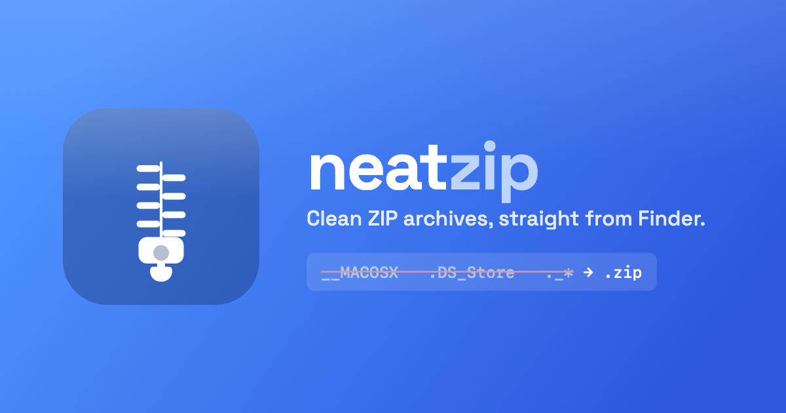

<p align="center">
  
</p>

# NeatZip

A single-purpose macOS app that creates **clean ZIP archives** — no
`__MACOSX`, `.DS_Store`, or `._*` junk — from the Finder right‑click menu or
by drag‑and‑drop, with optional password protection (ZipCrypto / AES‑256).

Rather than stripping metadata after the fact, NeatZip walks the tree and
writes only the files you want, so the junk Apple's Archive Utility adds is
never created in the first place.

## Build

The Xcode project is generated from `project.yml` with
[XcodeGen](https://github.com/yonik/XcodeGen):

```sh
xcodegen generate      # writes NeatZip.xcodeproj (gitignored)
open NeatZip.xcodeproj
```

Distribution (Developer ID sign + notarize + Sparkle appcast) is automated in
`scripts/release.sh`.

## License

**Source-available, all rights reserved.** The source is published for
transparency and auditability. It is **not** open source: no license to use,
copy, modify, redistribute, or resell NeatZip's own code is granted. All
rights are reserved by the author.

Bundled third-party components keep their own licenses — see
[`THIRD-PARTY-NOTICES.md`](THIRD-PARTY-NOTICES.md) (libdeflate: MIT,
minizip-ng: zlib, Sparkle: MIT).
